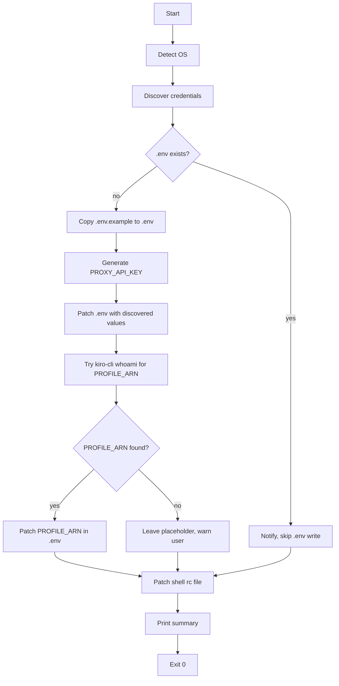

# Design Document

## Overview

A single POSIX-compatible shell script (`setup.sh`) at the project root. It runs top-to-bottom with no subcommands, performing credential discovery, `.env` generation, and shell rc file patching. No external dependencies beyond standard Unix tools (`openssl`, `jq`, `python3` as fallbacks).

## Architecture



## Components and Interfaces

### 1. OS Detection

```sh
detect_os() # sets OS_TYPE to "linux" or "macos"
```

Uses `uname -s`. Determines which shell rc file to target and which command variants to use.

### 2. Shell RC File Selection

```sh
select_rc_file() # sets RC_FILE to absolute path
```

- Linux: `~/.bashrc`
- macOS: prefers `~/.zshrc` if it exists, then `~/.bash_profile`, then `~/.bashrc` (creating it if needed)

Rationale: macOS ships zsh as default since Catalina; targeting `.zshrc` covers most users. If neither exists, fall back to `~/.bash_profile`.

### 3. Credential Discovery

```sh
discover_credentials() # sets CREDS_FILE to absolute path or empty
```

Search order:

1. `~/.kiro/` — any `.json` file. Validity check: file is readable and non-empty.
2. `~/.aws/sso/cache/kiro-auth-token.json` — exact name match first.
3. `~/.aws/sso/cache/` — any `.json` containing a `refreshToken` field AND an `expiresAt` (or `expires`) field whose value is not in the past.

Expiry check logic (no `jq` required path):
- Try `jq` first: `jq -r '.expiresAt // .expires // empty'`
- Fallback: `grep -o '"expiresAt":"[^"]*"'` + `date` comparison

Date comparison uses `date -d` (Linux) or `date -j -f` (macOS).

If multiple files pass validity, prefer `~/.kiro/` over `~/.aws/sso/cache/`.

### 4. PROXY_API_KEY Generation

```sh
generate_api_key() # prints a random string
```

- Primary: `openssl rand -base64 32 | tr -dc 'a-zA-Z0-9' | head -c 32`
- Fallback: read 32 bytes from `/dev/urandom`, encode with `od` or `python3 -c`

### 5. .env File Writer

```sh
write_env() # copies .env.example, patches key=value pairs in place
```

Uses `sed` to replace lines matching `^KEY=` or `^#.*KEY=` (commented-out lines) with the new value. This preserves all comments and structure from `.env.example`.

Patch targets:
- `PROXY_API_KEY` — always set to generated value
- `KIRO_CREDS_FILE` — set if discovered, otherwise leave commented
- `PROFILE_ARN` — set if `kiro-cli whoami` succeeds, otherwise leave placehold## 6. PROFILE_ARN Discovery

```sh
discover_profile_arn() # prints ARN string or empty
```

Runs `kiro-cli whoami 2>/dev/null`, extracts line 3 (the profile ARN). If `kiro-cli` is not on `$PATH` or returns non-zero, returns empty.

### 7. Shell RC Patcher

```sh
patch_rc_file() # appends exports to RC_FILE if not already present
```

Checks for existing `ANTHROPIC_BASE_URL` and `ANTHROPIC_API_KEY` exports using `grep -q`. Only appends missing lines. Wraps additions in a comment block:

```sh
# Added by go-kiro-gateway setup.sh
export ANTHROPIC_BASE_URL="http://localhost:8000"
export ANTHROPIC_API_KEY="<generated-key>"
# End go-kiro-gateway setup
```

### 8. Summary Printer

```sh
print_summary()
```

Prints a structured summary to stdout covering: credential file found/not found, `.env` written or skipped, `PROFILE_ARN` status, rc file patched or skipped, and reminder to `source` the rc file.

## Data Models

No persistent data structures. The script operates on:

- Shell variables (strings): `OS_TYPE`, `RC_FILE`, `CREDS_FILE`, `PROXY_API_KEY`, `PROFILE_ARN`
- Files: `.env`, `~/.bashrc` / `~/.zshrc` / `~/.bash_profile`

## Error Handling

| Condition | Behavior |
|---|---|
| `.env.example` missing | Exit 1 with message: "Run this script from the project root." |
| `.env` already exists | Print notice, skip `.env` steps, continue to rc patching |
| No credential file found | Warn, set `CREDS_FILE=""`, continue |
| `kiro-cli` not found or fails | Warn, leave `PROFILE_ARN` as placeholder, continue |
| `openssl` not found | Fall back to `/dev/urandom` + `od`/`python3` |
| `jq` not found | Fall back to `grep`-based JSON field extraction |
| rc file not writable | Exit 1 with message indicating the file and permission issue |
| Date parsing fails | Treat file as valid (conservative — don't discard a potentially good credential) |

The script uses `set -e` at the top but wraps optional steps (credential discovery, `kiro-cli`) in subshells or explicit `|| true` to prevent early exit on non-critical failures.

## Testing Strategy

Manual test matrix (no automated test framework — this is a shell script):

| Scenario | How to test |
|---|---|
| Fresh setup, credentials in `~/.kiro/` | Run on clean env with test JSON in `~/.kiro/` |
| Fresh setup, credentials in `~/.aws/sso/cache/` | Remove `~/.kiro/`, place test JSON in cache dir |
| Expired credential file | Place JSON with past `expiresAt`, verify it is skipped |
| No credentials found | Remove both dirs, verify warning and empty `KIRO_CREDS_FILE` |
| `.env` already exists | Pre-create `.env`, verify it is not modified |
| `kiro-cli` available | Mock with a shell function returning 3-line output |
| `kiro-cli` not available | Remove from PATH, verify graceful fallback |
| macOS rc file selection | Run with `uname` mocked to return `Darwin` |
| Duplicate rc exports | Run script twice, verify no duplicate lines |
| Missing `openssl` | Remove from PATH, verify fallback key generation |
| Missing `jq` | Remove from PATH, verify grep-based expiry check |

Key design decision: using `sed -i` for in-place `.env` patching rather than rewriting the file preserves all comments and optional variable structure from `.env.example`, which is important for user discoverability of available options.

Risk flag: `sed -i` syntax differs between GNU sed (Linux) and BSD sed (macOS) — `-i ''` is required on macOS. The script will detect OS and use the correct form.
